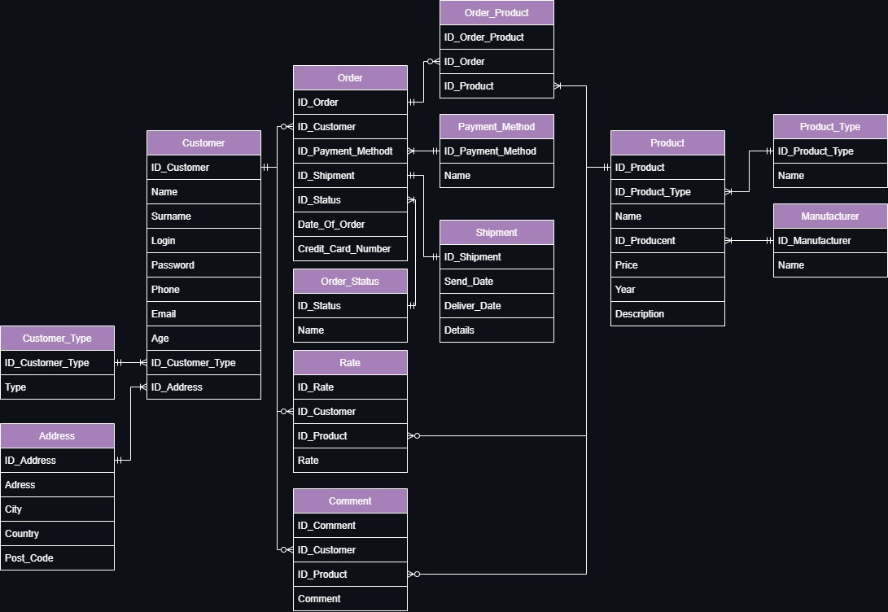
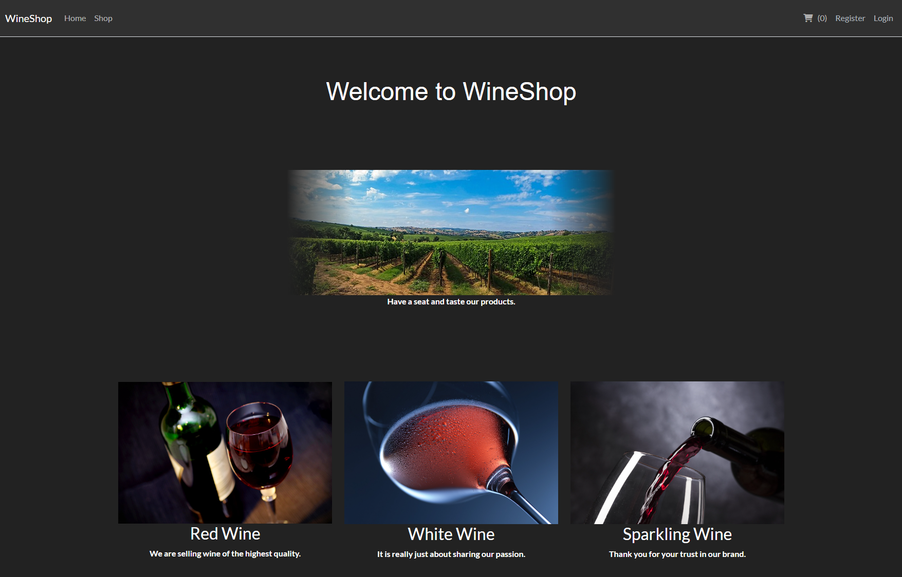
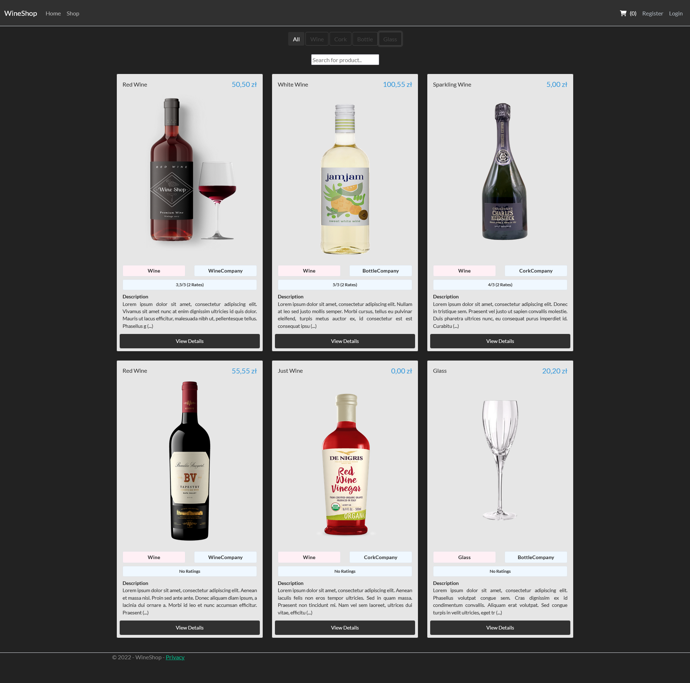
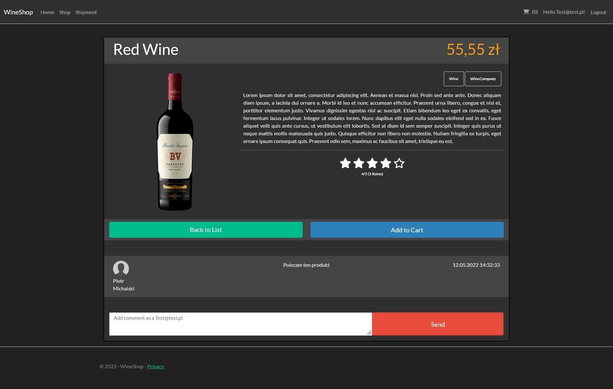
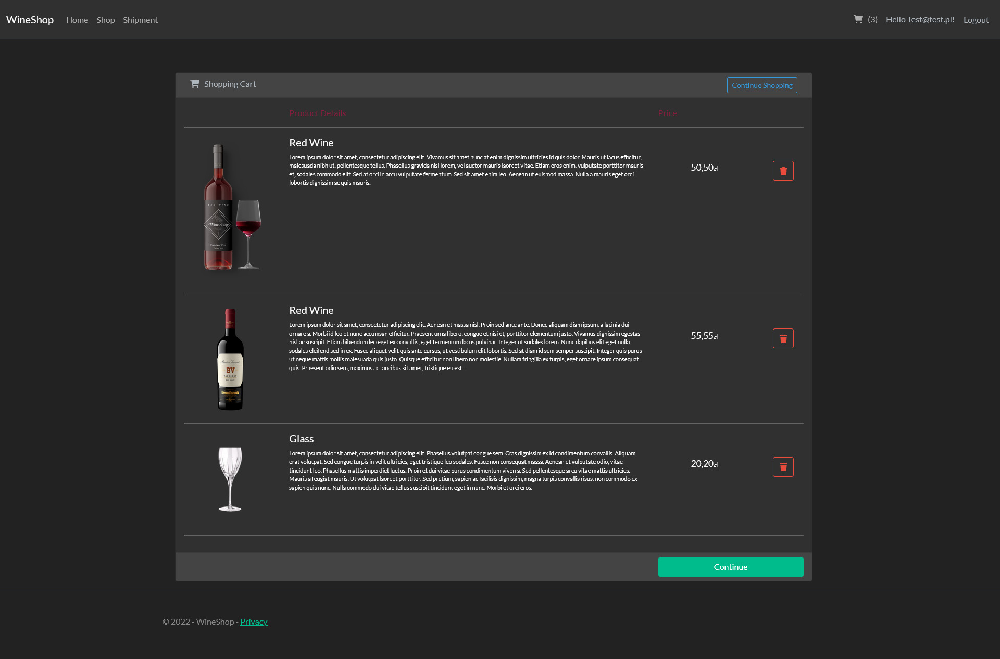
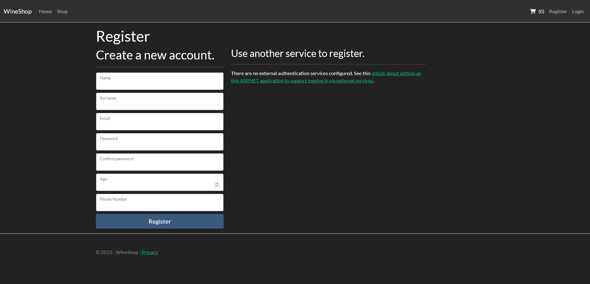
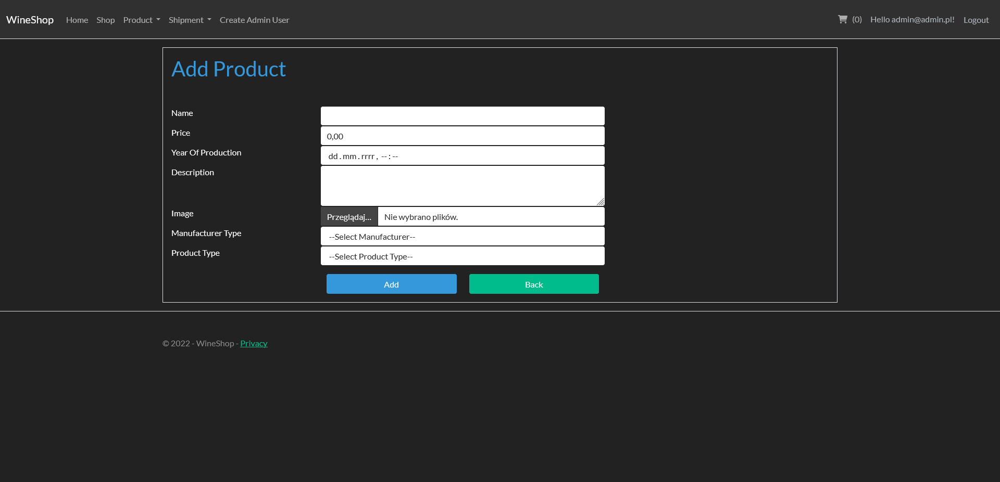
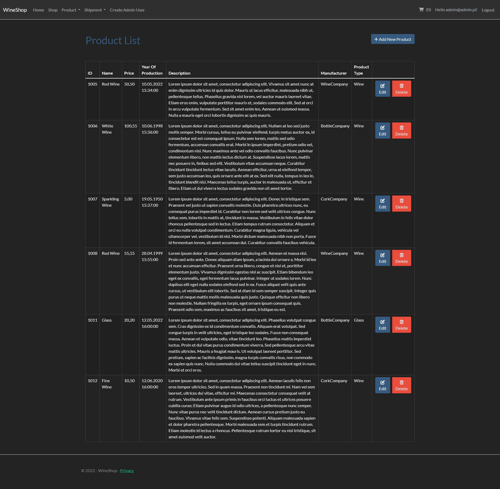

# 🍷 WineShop


---

## 📌 About the Project

**WineShop** is an ASP.NET Core MVC e-commerce web application for browsing, reviewing and ordering wine products.

The project was created as a portfolio application to demonstrate practical .NET backend and full-stack MVC skills, including:

- 🔐 authentication and authorization,
- 👥 role-based access control,
- 🛒 shopping cart,
- 📦 orders,
- 🗃️ Entity Framework Core,
- 🧾 SQL Server database,
- 🧱 MVC architecture,
- 🐳 Docker-based local setup.

The goal of this project was to build a complete, working web application rather than a small isolated code sample.

---

## 📚 Table of Contents

- [Features](#-features)
- [User Roles](#-user-roles)
- [Tech Stack](#-tech-stack)
- [Architecture](#-architecture)
- [Database](#-database)
- [Getting Started](#-getting-started)
  - [Run with Docker](#-run-with-docker)
  - [Run locally without Docker](#-run-locally-without-docker)
- [Screenshots](#-screenshots)
- [Project Structure](#-project-structure)
- [Known Limitations](#-known-limitations)
- [Future Improvements](#-future-improvements)
- [Project Status](#-project-status)

---

## ✨ Features

### 🍾 Product Browsing

- Browse wine products
- View product details
- Display product images
- Browse product types and manufacturers
- Read customer comments and ratings

### 🔐 Authentication and Authorization

- User registration
- User login and logout
- ASP.NET Core Identity integration
- Role-based authorization for `Customer` and `Admin`

### 🛒 Customer Features

- Edit user profile
- Add products to the shopping cart
- View and manage cart content
- Place orders
- Choose shipment and payment method
- Add product comments
- Rate products
- Delete own comments and ratings

### 🛠️ Admin Features

- Manage products
- Manage product types
- Manage manufacturers
- Manage payment methods
- Manage shipment options
- Manage order statuses
- Delete inappropriate comments
- Manage customer-related data
- Update order/delivery status

---

## 👥 User Roles

### 👤 Guest

Guests can browse the public part of the application.

Available actions:

- Browse products
- View product details
- Read comments and ratings
- Register an account
- Log in

---

### 🧑‍💼 Customer

Customers are registered users.

Available actions:

- Manage their profile
- Add products to cart
- Place orders
- Comment on products
- Rate products
- Delete their own comments and ratings

---

### 🛡️ Admin

Admins can manage the shop data and selected user-generated content.

Available actions:

- Create, update and delete products
- Manage product dictionaries such as manufacturers, product types, payment methods and shipment options
- Manage order statuses
- Remove comments when necessary

---

## 🧰 Tech Stack

### ⚙️ Backend

- C#
- ASP.NET Core MVC
- ASP.NET Core Identity
- Entity Framework Core
- Razor Views
- Session-based shopping cart

### 🎨 Frontend

- HTML
- CSS
- Bootstrap
- JavaScript
- Razor Views

### 🗄️ Database

- Microsoft SQL Server 2019
- Entity Framework Core migrations
- Seeded initial product/catalog data

### 🐳 DevOps / Tooling

- Docker
- Docker Compose
- Git
- Visual Studio / Visual Studio Code

---

## 🏗️ Architecture

The application follows the **MVC pattern** and separates responsibilities into several layers:

- `Controllers` handle HTTP requests and return views.
- `Models` define domain and database entities.
- `ViewModels` are used to pass page-specific data to Razor views.
- `Services` contain business logic extracted from controllers.
- `Data` contains the Entity Framework database context.
- `Utility` contains helper classes, constants, session extensions and database initialization logic.
- `Views` contain Razor UI templates.
- `wwwroot` contains static assets such as CSS, JavaScript and images.

The application uses dependency injection to register services used by controllers.

---

## 🗃️ Database

The application uses **Entity Framework Core** with **SQL Server**.

The database contains entities such as:

- 🍷 Products
- 🏷️ Product types
- 🏭 Manufacturers
- 💬 Comments
- ⭐ Ratings
- 📦 Orders
- 📋 Order items
- 💳 Payment methods
- 🚚 Shipment options
- 📌 Order statuses
- 👤 Application users

The application applies EF Core migrations during startup and seeds basic roles:

- `Admin`
- `Customer`

Initial catalog data is also seeded, including sample products, manufacturers, product types, payment methods and order statuses.

---

## 🚀 Getting Started

### ✅ Prerequisites

To run the project locally, install:

- [.NET 6 SDK](https://dotnet.microsoft.com/en-us/download/dotnet/6.0)
- [Docker Desktop](https://www.docker.com/products/docker-desktop/)
- SQL Server, if running without Docker

---

## 🐳 Run with Docker

### 1. Clone the repository

```bash
git clone https://github.com/Claverin/WineShop.git
cd WineShop
```

### 2. Create a `.env` file in the repository root

```env
SA_PASSWORD=YourStrongPassword123!
DB_HOST=db
DB_NAME=WineShopDb
DB_USER=sa
```

### 3. Start the application

```bash
docker compose up --build
```

### 4. Open the application

```text
http://localhost:8080
```

The Docker setup starts:

- 🗄️ SQL Server 2019 container
- 🌐 ASP.NET Core MVC application container

The application runs on port:

```text
8080
```

---

## 💻 Run locally without Docker

### 1. Clone the repository

```bash
git clone https://github.com/Claverin/WineShop.git
cd WineShop
```

### 2. Open the solution

```text
WineShop.sln
```

### 3. Configure the connection string

Open:

```text
WineShop/appsettings.json
```

Example connection string:

```json
{
  "ConnectionStrings": {
    "DefaultConnection": "Server=localhost;Database=WineShopDb;Trusted_Connection=True;TrustServerCertificate=True;MultipleActiveResultSets=True"
  }
}
```

### 4. Restore packages

```bash
dotnet restore
```

### 5. Apply migrations

```bash
dotnet ef database update --project WineShop
```

### 6. Run the application

```bash
dotnet run --project WineShop
```

### 7. Open the application in the browser

The default local address is usually:

```text
https://localhost:5001
```

or:

```text
http://localhost:5000
```

depending on the launch profile.

---

## 📸 Screenshots

### 🧩 Entity Relationship Diagram



---

### 🏠 Main Page



---

### 🍷 Shop Page



---

### 🔎 Product Details



---

### 🛒 Shopping Cart



---

### 📝 Account Registration



---

### ➕ Add Product



---

### 📋 Product List



---

## 📁 Project Structure

```text
WineShop/
├── Areas/
│   └── Identity/
├── Controllers/
├── Data/
├── Migrations/
├── Models/
│   └── ViewModels/
├── Services/
│   └── Interfaces/
├── Utility/
├── Views/
├── wwwroot/
├── Program.cs
├── WC.cs
└── WineShop.csproj
```

Main repository files:

```text
WineShop.sln
Dockerfile
docker-compose.yml
.env.example
README.md
Screenshots/
```

---

## ⚠️ Known Limitations

This is a portfolio project, not a production-ready commercial shop.

Current limitations:

- No real payment provider integration
- No email confirmation flow
- No automated test project
- Admin role assignment may require manual configuration during local testing
- The UI is functional but can still be improved visually
- Some parts of the application can be further refactored into cleaner service-level logic

---

## 🔮 Future Improvements

Possible improvements:

- 🧪 Add integration tests for main user flows
- ⚙️ Add CI pipeline with build and test steps
- 🛡️ Improve validation and error handling
- 🔍 Add pagination and filtering for product lists
- 🖼️ Add image upload handling for products
- 📧 Add email notifications for orders
- 📊 Improve admin dashboard UX
- 💳 Add payment provider mock/integration
- 🌐 Add API endpoints for selected operations

---

## 👨‍💻 Author

Created by [Claverin](https://github.com/Claverin).

---
